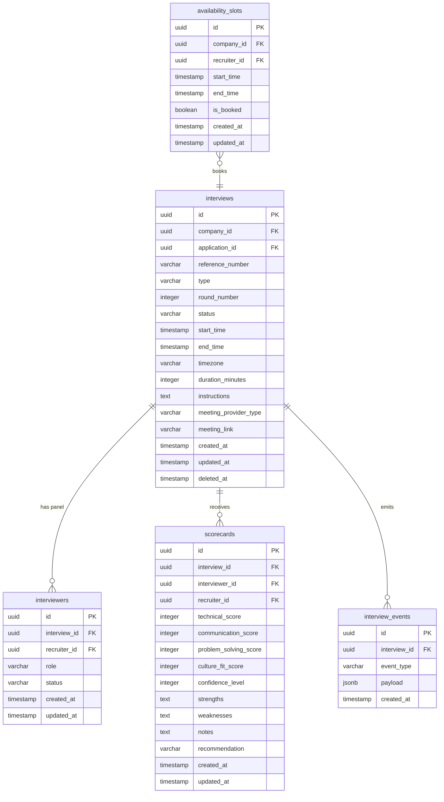

# Interview Service Specification

The **Interview Service** manages the scheduling lifecycle, recruiter availability, multi-stage panel interviews, candidate bookings, and scorecard submissions for Smart Hire candidate evaluations.

---

## 1. Database Schema

The Interview Service operates entirely within the isolated `interview` schema of the PostgreSQL database.



---

## 2. API Endpoints

All endpoints are versioned under `/api/v1/interview` and require authentication.

### 2.1. Interview Scheduling & Booking

*   **POST** `/api/v1/interview`
    *   Schedules an interview for a candidate application.
    *   *Payload:*
        ```json
        {
          "applicationId": "00000000-0000-0000-0000-000000000002",
          "meetingTitle": "System Design Panel",
          "type": "System Design",
          "roundNumber": 2,
          "startTime": "2026-07-13T10:00:00Z",
          "endTime": "2026-07-13T11:00:00Z",
          "timezone": "Europe/London",
          "durationMinutes": 60,
          "meetingProviderType": "zoom",
          "interviewers": ["00000000-0000-0000-0000-000000000004"]
        }
        ```
    *   *Validations:* Overlap checks are executed on the candidate (across all active interviews) and the panel recruiters.

*   **POST** `/api/v1/interview/:id/book`
    *   Enables a candidate to select and book a recruiter availability slot.
    *   *Payload:*
        ```json
        {
          "slotId": "00000000-0000-0000-0000-000000000006",
          "applicationId": "00000000-0000-0000-0000-000000000002",
          "meetingTitle": "Job Interview",
          "type": "Technical",
          "meetingProviderType": "google_meet"
        }
        ```

*   **POST** `/api/v1/interview/:id/reschedule`
    *   Reschedules an active interview. Performs candidate & recruiter overlap checks.

*   **POST** `/api/v1/interview/:id/cancel`
    *   Cancels an active interview, releasing the recruiters and setting the status to `cancelled`.

---

### 2.2. Availability Management

*   **POST** `/api/v1/interview/availability`
    *   Saves recruiter availability slots. Ensures no overlapping slot exists.
*   **GET** `/api/v1/interview/availability`
    *   Fetches slots filtered by recruiter, company, or booking state.

---

### 2.3. Scorecard Evaluations

*   **POST** `/api/v1/interview/:id/scorecard`
    *   Submits candidate evaluation metrics from a recruiter.
    *   *Payload:*
        ```json
        {
          "interviewerId": "00000000-0000-0000-0000-000000000005",
          "technicalScore": 4,
          "communicationScore": 5,
          "problemSolvingScore": 4,
          "cultureFitScore": 5,
          "confidenceLevel": 4,
          "strengths": "Great architecture knowledge",
          "weaknesses": "Slightly slow coding speed",
          "notes": "Solid candidate, recommend moving to final round",
          "recommendation": "hire"
        }
        ```
    *   *Transitions:* If all panel members submit scorecards, the parent interview status transitions to `completed`.

---

## 3. Decoupled Meeting Integrations

Meeting links generation is fully abstracted through the `MeetingProvider` interface:
```typescript
export interface MeetingProvider {
  generateMeetingLink(title: string, startTime: string, durationMinutes: number): Promise<string>;
}
```

The `meetingProviderFactory` dynamically returns a mock provider for `google_meet`, `zoom`, or `msteams` generating stubbed conference URLs. This architecture allows adding real calendar integrations (OAuth, Graph API, Google Calendar API) in the future without modifying core business rules.
