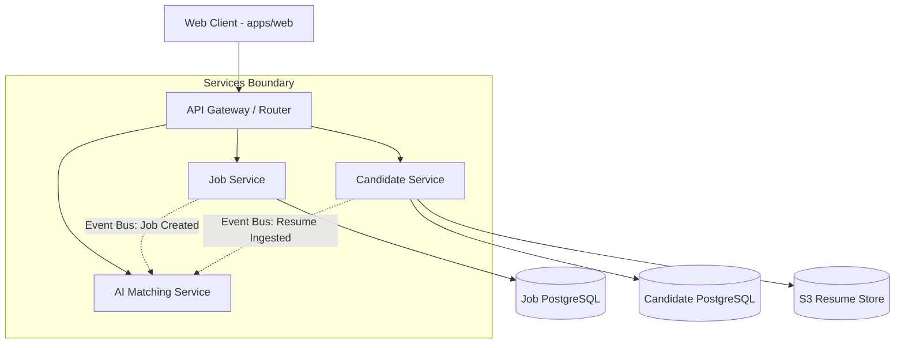

# System Architecture - Smart Hire

This document defines the architectural guidelines, service boundaries, and monorepo structure for the **Smart Hire** platform.

---

## 1. Architectural Philosophy

Smart Hire uses a **Microservice Architecture** combined with a **Monorepo** development model to balance deployment independence with developer productivity.

Key tenets:

- **Loose Coupling**: Services run in separate containers, maintain isolated databases (Database-per-Service pattern), and communicate asynchronously.
- **Unified Interfaces**: Type mappings, configuration engines, and visual systems are centralized in shared packages to prevent duplication.
- **Decoupled Builds**: Turborepo manages the build pipeline to run only tasks that are affected by code changes.

---

## 2. Monorepo Folder Structure

The code is organized into two primary scopes: applications (`apps/`) and libraries (`packages/`).

```
smart-hire/
├── apps/
│   └── web/                     # Next.js 15 App Router Frontend & Portal
├── packages/
│   ├── config/                  # Shared configurations
│   │   ├── eslint/              # Flat Config templates (base, next)
│   │   └── typescript/          # Base TSConfig blueprints (base, nextjs)
│   ├── ui/                      # Shared design system components (React & Tailwind)
│   ├── utils/                   # Workspace-wide utility helpers (cn class merger, etc.)
│   ├── logger/                  # Unified, level-prefixed logger library
│   └── types/                   # Single source of truth for TypeScript interfaces/models
├── docs/                        # Project architectural and business documentation
├── docker/                      # Development and deployment Dockerfiles
├── docker-compose.yml           # Local dev container orchestration
├── pnpm-workspace.yaml          # Defines workspaces limits and package security bounds
├── turbo.json                   # Pipeline cache and task dependency graph rules
└── package.json                 # Monorepo workspace-wide scripts and dependencies
```

---

## 3. Microservice Boundaries

The platform is designed around distinct functional boundaries:



### 3.1. Web Application (`apps/web`)

- **Role**: Client interface for candidates, recruiters, and administrators.
- **Tech Stack**: Next.js 15 (App Router), React 19, Tailwind CSS.
- **Communication**: HTTP REST requests to the API Gateway.

### 3.2. Job Service (`apps/job-service` - conceptual)

- **Role**: Manages job creation, departments, hiring managers permissions, and public postings.
- **Database**: Dedicated PostgreSQL database.

### 3.3. Candidate Service (`apps/candidate-service` - conceptual)

- **Role**: Manages resume ingest, candidate profiles, and application statuses.
- **Storage**: AWS S3 (or MinIO locally) for raw resume documents, PostgreSQL for database profiles.

### 3.4. AI Matching Service (`apps/ai-service` - conceptual)

- **Role**: Runs semantic background matching and matches candidates against job parameters.
- **Communication**: Receives asynchronous event triggers (e.g. `resume.parsed`, `job.published`) via message broker (RabbitMQ/Kafka).

---

## 4. Shared Libraries Integration

Shared library packages (`packages/*`) are referenced inside the workspace using the `workspace:*` dependency format in `package.json`.

```
                  ┌──────────────┐
                  │   apps/web   │
                  └──────┬───────┘
                         │
        ┌────────────────┼────────────────┐
        ▼                ▼                ▼
┌──────────────┐ ┌──────────────┐ ┌──────────────┐
│ packages/ui  │ │packages/types│ │packages/utils│
└──────┬───────┘ └──────────────┘ └──────────────┘
       │
       ▼
┌──────────────┐
│packages/utils│
└──────────────┘
```

- **Dependencies Rules**:
  - `packages/ui` depends on `packages/utils` (for `cn` utility styling merges).
  - `apps/web` imports from `packages/ui`, `packages/types`, `packages/utils`, and `packages/logger`.
  - Packages must remain completely independent of application business logic.

---

## 5. Backend Microservices Specification

This registry documents the architecture, database ownership, asynchronous event patterns, public HTTP APIs, and dependency mappings for each microservice in the Smart Hire platform.

---

### 5.1. Identity Service

- **Responsibilities**: User authentication, session management, OAuth integration (Google & Microsoft Workspace), token issuance (JWT), role-based access control (RBAC), multi-factor authentication (MFA).
- **Database Ownership**: `identity_db` (PostgreSQL)
  - Tables: `users`, `sessions`, `refresh_tokens`, `roles_permissions`.
- **Events Published**:
  - `user.registered` (user_id, email, first_name, last_name, role)
  - `user.login` (user_id, timestamp)
  - `user.password_reset_requested` (user_id, email, token)
- **Events Consumed**: None.
- **Public APIs**:
  - `POST /api/v1/auth/register` (Register new user)
  - `POST /api/v1/auth/login` (Login and retrieve JWT token pair)
  - `POST /api/v1/auth/refresh` (Refresh access tokens)
  - `POST /api/v1/auth/logout` (Invalidate current session)
  - `GET /api/v1/auth/me` (Retrieve current session data)
- **Dependencies**: None.

---

### 5.2. Organization Service

- **Responsibilities**: Enterprise workspaces onboarding, subscription tier management, seat licensing, recruiter/hiring manager invitations, department hierarchy configuration.
- **Database Ownership**: `organization_db` (PostgreSQL)
  - Tables: `organizations`, `workspace_memberships`, `invitations`, `subscription_details`.
- **Events Published**:
  - `organization.created` (org_id, owner_id, name)
  - `organization.member_invited` (org_id, invite_id, email, role)
  - `organization.member_joined` (org_id, user_id, role)
- **Events Consumed**:
  - `user.registered` (claims pending workspace invitations based on email match)
- **Public APIs**:
  - `POST /api/v1/organizations` (Register a new organization)
  - `GET /api/v1/organizations/:orgId` (Fetch workspace metadata)
  - `POST /api/v1/organizations/:orgId/invites` (Send invitation to recruiter/manager)
  - `GET /api/v1/organizations/:orgId/members` (List all active members)
- **Dependencies**: Identity Service (for user mapping).

---

### 5.3. Candidate Service

- **Responsibilities**: Maintains candidates profiles, work history, education achievements, contact metadata, and candidates job seeker portal attributes.
- **Database Ownership**: `candidate_db` (PostgreSQL)
  - Tables: `candidates_profiles`, `work_experiences`, `education_records`, `candidate_skills`.
- **Events Published**:
  - `candidate.profile_created` (candidate_id, user_id, email)
  - `candidate.profile_updated` (candidate_id, fields_updated)
- **Events Consumed**:
  - `user.registered` (creates candidates profile stub if role is candidate)
  - `resume.parsed` (populates candidate profile fields using parsed resume fields)
- **Public APIs**:
  - `POST /api/v1/candidates` (Create candidate profile)
  - `GET /api/v1/candidates/:candidateId` (Fetch candidate profile details)
  - `PATCH /api/v1/candidates/:candidateId` (Modify candidate profile)
- **Dependencies**: Identity Service.

---

### 5.4. Resume Service

- **Responsibilities**: PDF/DOCX resume file upload management, virus scanning, text extraction (OCR), and structured parser mapping.
- **Database Ownership**: `resume_db` (PostgreSQL) & Object Storage (S3 / MinIO)
  - Tables: `resumes`, `parsing_jobs`, `extraction_logs`.
  - Object Store: `resumes-bucket`
- **Events Published**:
  - `resume.uploaded` (resume_id, candidate_id, s3_url)
  - `resume.parsed` (resume_id, candidate_id, parsed_json_content)
  - `resume.parsing_failed` (resume_id, candidate_id, error_reason)
- **Events Consumed**: None.
- **Public APIs**:
  - `POST /api/v1/resumes/upload-url` (Generate secure S3 presigned upload URL)
  - `POST /api/v1/resumes/:resumeId/parse` (Trigger parsing worker)
  - `GET /api/v1/resumes/:resumeId/status` (Check parser status)
- **Dependencies**: S3 Object Storage, Candidate Service.

---

### 5.5. Job Service

- **Responsibilities**: Creation and modification of job openings, publishing workflows, job listing board settings, SEO configurations, and requirements parameters.
- **Database Ownership**: `job_db` (PostgreSQL)
  - Tables: `jobs`, `departments`, `hiring_boards`.
- **Events Published**:
  - `job.created` (job_id, org_id, title)
  - `job.published` (job_id, org_id, title, department, skills_required)
  - `job.closed` (job_id, org_id)
- **Events Consumed**: None.
- **Public APIs**:
  - `POST /api/v1/jobs` (Create job opening draft)
  - `GET /api/v1/jobs` (Retrieve public job postings with filtering)
  - `GET /api/v1/jobs/:jobId` (Fetch job description details)
  - `PATCH /api/v1/jobs/:jobId/status` (Transition job status)
- **Dependencies**: Organization Service.

---

### 5.6. Application Service

- **Responsibilities**: Tracks applicant submissions, recruitment pipelines, stage histories (applied, screening, interview, offer, rejected), and workflow transitions.
- **Database Ownership**: `application_db` (PostgreSQL)
  - Tables: `applications`, `application_stages`, `stage_transitions_history`.
- **Events Published**:
  - `application.submitted` (application_id, job_id, candidate_id, resume_id)
  - `application.stage_changed` (application_id, old_stage, new_stage, updated_by)
  - `application.rejected` (application_id, job_id, candidate_id)
- **Events Consumed**:
  - `candidate.profile_updated` (syncs candidate metadata)
  - `job.closed` (cancels/archives all active applications for the closed job)
- **Public APIs**:
  - `POST /api/v1/applications` (Submit job application)
  - `GET /api/v1/applications/:appId` (Fetch application status)
  - `PATCH /api/v1/applications/:appId/stage` (Transition application to new stage)
  - `GET /api/v1/jobs/:jobId/applications` (List all applications for a specific job)
- **Dependencies**: Candidate Service, Job Service, Resume Service.

---

### 5.7. Assessment Service

- **Responsibilities**: Manage logic challenges and skill assessments, execute grading criteria, configure evaluation thresholds, and record applicant scores.
- **Database Ownership**: `assessment_db` (PostgreSQL)
  - Tables: `assessments`, `questions`, `assessment_attempts`, `scores`.
- **Events Published**:
  - `assessment.assigned` (attempt_id, application_id, candidate_id, assessment_id)
  - `assessment.completed` (attempt_id, application_id, score, passed)
- **Events Consumed**:
  - `application.stage_changed` (auto-triggers assessment email invite on stage match)
- **Public APIs**:
  - `POST /api/v1/assessments` (Create coding/logic challenge template)
  - `POST /api/v1/assessments/assign` (Send assessment link to applicant)
  - `POST /api/v1/attempts/:attemptId/submit` (Record candidate answers)
  - `GET /api/v1/attempts/:attemptId/results` (Fetch score card and feedback metrics)
- **Dependencies**: Application Service.

---

### 5.8. Interview Service

- **Responsibilities**: Coordinate recruiter/candidate availability, sync calendars (Google Workspace & Outlook), generate video meet links (Zoom, Teams, Meet), and aggregate hiring feedback.
- **Database Ownership**: `interview_db` (PostgreSQL)
  - Tables: `interviews_slots`, `interviewer_availabilities`, `feedback_forms`, `scorecards`.
- **Events Published**:
  - `interview.scheduled` (interview_id, application_id, candidate_id, time, meet_url)
  - `interview.feedback_submitted` (interview_id, interviewer_id, score, comment)
  - `interview.completed` (interview_id, application_id)
- **Events Consumed**:
  - `application.stage_changed` (generates scheduling invitation when moving to interview stage)
- **Public APIs**:
  - `POST /api/v1/interviews/schedule` (Book interview time slot)
  - `GET /api/v1/interviews/availability` (Fetch recruiter available windows)
  - `POST /api/v1/interviews/:interviewId/feedback` (Recruiter score submission)
- **Dependencies**: Application Service, Notification Service.

---

### 5.9. Notification Service

- **Responsibilities**: Render and dispatch transactional emails, SMS messaging, web push notifications, and Slack/Teams updates for internal hiring squads.
- **Database Ownership**: `notification_db` (PostgreSQL)
  - Tables: `notification_templates`, `notification_logs`, `delivery_receipts`.
- **Events Published**:
  - `notification.delivered` (notification_id, recipient, channel)
  - `notification.failed` (notification_id, recipient, reason)
- **Events Consumed**:
  - `user.password_reset_requested`
  - `organization.member_invited`
  - `application.submitted`
  - `assessment.assigned`
  - `interview.scheduled`
  - `application.rejected`
- **Public APIs**:
  - `POST /api/v1/notifications/send` (Internal routing fallback endpoint)
  - `PATCH /api/v1/notifications/preferences` (Manage email/SMS preferences)
- **Dependencies**: Direct API keys integration with SendGrid/Twilio/AWS SES.

---

### 5.10. AI Service

- **Responsibilities**: Vectorizes candidate profiles and skills, generates candidate-to-job match scores, outputs detailed fit explanations, anonymizes profiles for bias reduction, and constructs tailored interview prompt questions.
- **Database Ownership**: `ai_db` (PostgreSQL / Vector Database)
  - Tables: `match_records`, `skills_embeddings`, `anonymization_keys_mappings`.
- **Events Published**:
  - `ai.match_scored` (application_id, candidate_id, job_id, score, fit_reasoning)
  - `ai.questions_generated` (interview_id, prompt_questions_list)
- **Events Consumed**:
  - `resume.parsed` (auto-evaluates candidate matching metrics)
  - `interview.scheduled` (generates customized interviewer questions sheet)
- **Public APIs**:
  - `POST /api/v1/ai/anonymize` (Strip candidate demographic markers)
  - `POST /api/v1/ai/match` (Ad-hoc run candidate-to-job matching)
- **Dependencies**: External LLM and embedding providers (OpenAI / Anthropic APIs).

---

### 5.11. Analytics Service

- **Responsibilities**: Tracks recruitment conversion pipelines, logs sourcing channels effectiveness, aggregates average time-to-hire metrics, and presents interactive admin charts.
- **Database Ownership**: `analytics_db` (ClickHouse / TimescaleDB)
  - Tables: `pipeline_metrics_snapshots`, `funnel_events`, `sourcing_telemetry`.
- **Events Published**: None.
- **Events Consumed**:
  - `user.registered`
  - `job.published`
  - `application.submitted`
  - `application.stage_changed`
  - `assessment.completed`
  - `interview.feedback_submitted`
- **Public APIs**:
  - `GET /api/v1/analytics/pipeline-funnel` (Fetch stage conversion rates)
  - `GET /api/v1/analytics/time-to-hire` (Fetch average hiring duration metrics)
  - `GET /api/v1/analytics/sourcing-channels` (Sourcing performance metrics)
- **Dependencies**: None.
